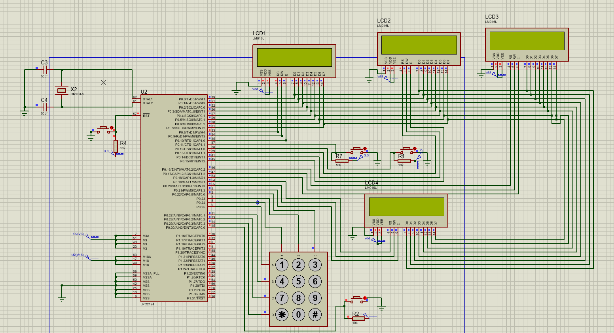

# Electronic-Voting-machine-using-ARM7

An electornic voting machine using ARM7-TDMI-s Micro Processor using NXP/LPC2124 model. 
 

**The project have been done using proteus and IAR Embedded workbench using C programming languages**

## Features of the project

- Voting for two candidates
- Vote Counting
- Shows the number of votes for the two candidates
- Calculate the vote difference between the two candidates
- Annouce the winner
- Show the vote difference

  ## Illustration

  ### 1. The project Design
  The following image shows the general project schematic design
   

 
  ### 2. Starting
  The following image shows the project without any input vote
    

 
  ### 3. When Candidate one is leading
The following image shows when candidate 1 has more votes than candidate 2
  

 
  ### 4. When Candidate two is leading 
  The following image shows when candidate two has more votes and leading 
    

 
### 5. Tie
The following image shows when the two candidates have equal votes
  

 
### 6. Scalability
This project is very large and scalable project we can integrate it with a database to register voters, we can include authentication methods such as fingerprint or password authentication.
The following is what I have started to make the project password authenticated/users enter their password using keypad and press the button to be elgible for voting 
  

 

Tewodros Seble
 
All rights reserved
